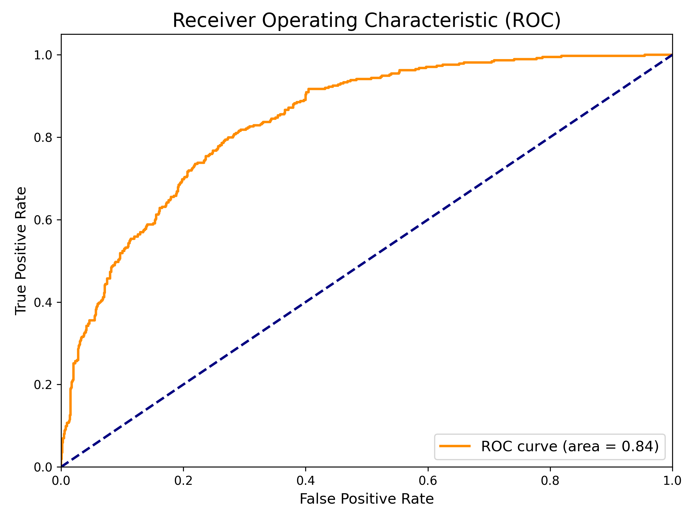
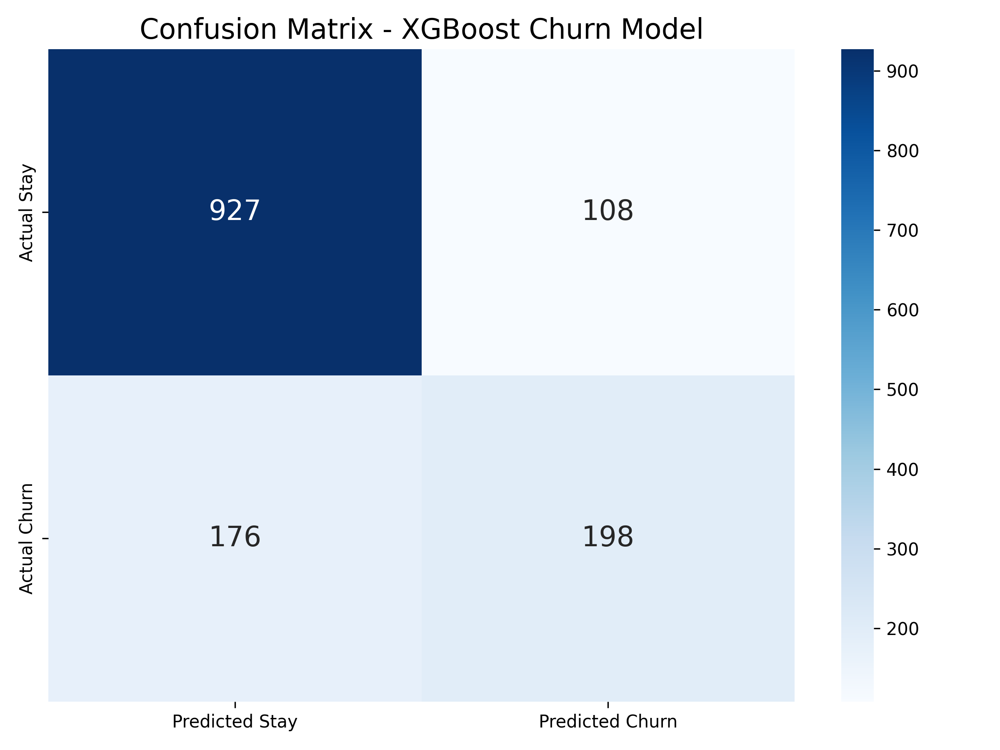
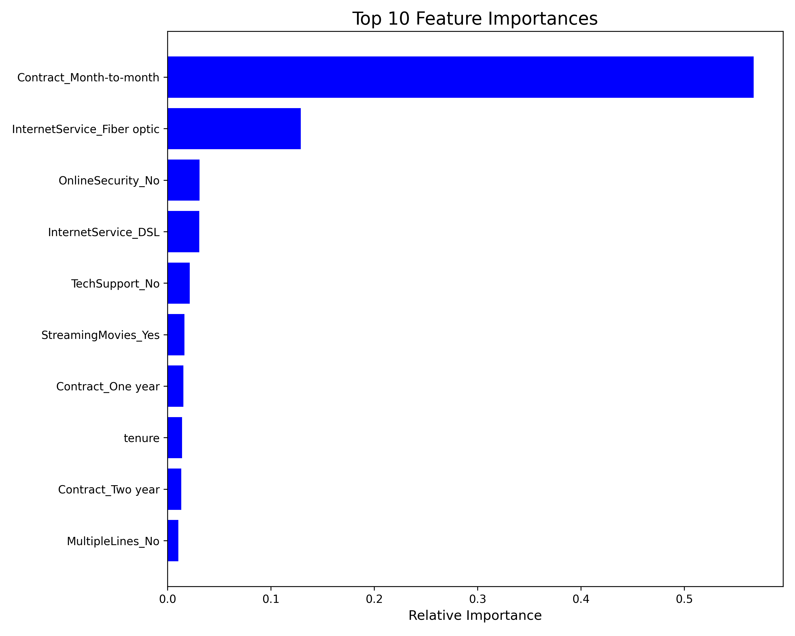

# Customer Churn Prediction Model

An end-to-end industry-oriented Customer Churn Prediction System. This project encompasses data ingestion, feature engineering, machine learning modeling (XGBoost), model explainability (SHAP), a FastAPI serving layer, and a Next.js Success-Ops dashboard.

## Architecture

1. **ML Pipeline (`src/`)**: Loads the original IBM Telco dataset and trains an XGBoost classifier pipeline with scikit-learn.
2. **Backend Serving (`serving/`)**: A FastAPI application exposing `/score` and `/explain` endpoints.
3. **Frontend Dashboard (`apps/web/`)**: A Next.js 15 application using TailwindCSS and Lucide-React to provide a premium Success-Ops UI.

## Getting Started

### 1. Model Training
```bash
# Install dependencies
pip install -r requirements.txt

# Train model
python src/train.py
```

### 2. Run Backend
```bash
# Run the FastAPI server on port 8000
python serving/app.py
```

### 3. Run Frontend
```bash
# Open a new terminal
cd apps/web
npm install
npm run dev
```
Navigate to `http://localhost:3000` to see the Success-Ops dashboard.

## Performance Metrics
Here are the evaluation metrics of our XGBoost model on the test set:

### ROC Curve & Accuracy
The model achieves an **80% Accuracy** and a **0.84 ROC-AUC score**, which is highly realistic for a telecommunications churn dataset.


### Confusion Matrix


### Top Feature Importances


## Proof Strategy
See `PROOF_STRATEGY.md` for the day-wise plan to push this to GitHub for your portfolio.
